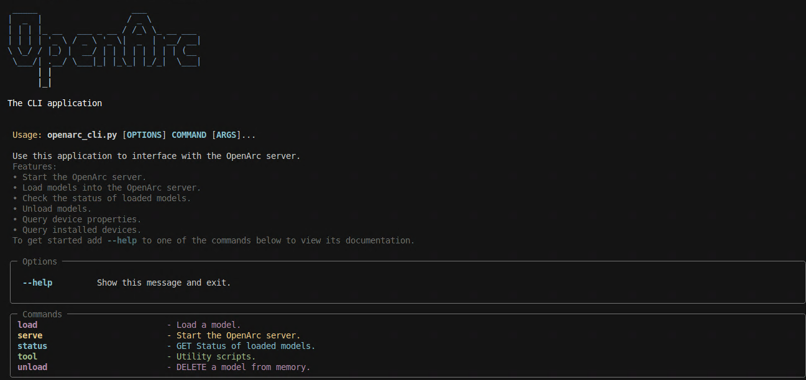
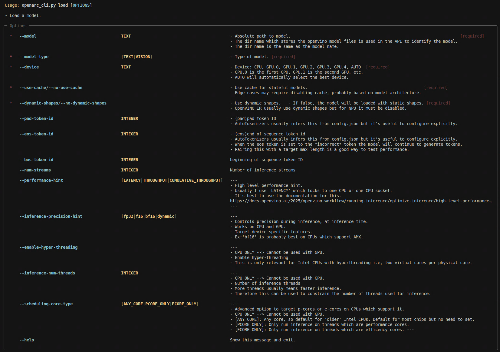

[](https://discord.gg/maMY7QjG)
[](https://huggingface.co/Echo9Zulu)


> [!NOTE]
> OpenArc is under active development. Expect breaking changes.


**OpenArc** is an inference engine which makes using Intel devices as accelerators easier.

 Built with Optimum-Intel to leverage hardware acceleration on Intel CPUs, GPUs and NPUs through OpenVINO runtime that integrates closely with Huggingface Transformers. 

Under the hood OpenArc implements a FastAPI layer over a growing collection of Transformers integrated AutoModel classes from Optimum-Intel. These enable accelerating inference on a wide range of tasks, models and source frameworks.

OpenArc currently supports **text generation** and **text generation with vision** over OpenAI API endpoints. 

Support for speculative decoding, generating embeddings, speech tasks, image generation, PaddleOCR, and others are planned.

## Features

- OpenAI compatible endpoints
- Validated OpenWebUI support, but it should work elsewhere
- Load multiple vision/text models concurrently on multiple devices for hotswap/multi agent workflows
- **Most** HuggingFace text generation models
- Growing set of vision capable LLMs:
    - Qwen2-VL 
    - Qwen2.5-VL 
    - Gemma 3

### NEW Command Line Application!
  - Built with click and rich-click
  - OpenArc's server has been thoroughly documented there. Much cleaner!
  - Coupled with officual documentation this makes learning OpenVINO easier. 
  
### Performance metrics on every completion
   - ttft: time to generate first token
   - generation_time : time to generate the whole response
   - number of tokens: total generated tokens for that request (includes thinking tokens)
   - tokens per second: measures throughput.
   - average token latency: helpful for optimizing zero or few shot tasks
 	  
## Command Line Application

OpenArc now has a command line application for interfacing with the server! Gradio has been put to pasture. From those orange ashes 

To get started run

```
python openarc_cli.py --help
```

The screen should look like this:



Here are some other useful commands: 

To launch the server:

```
python openarc_cli.py serve start
```


To load a model open another temrinal:

```
python openarc_cli.py load --help
```
This menu gives a breakdown of how the many different optimzation parameters work and broadly how they can be used together. 





The CLI application will surface C++ errors from the OpenVINO runtime as you tinker; in practice this is sort of like print debugging your LLM optimizations directly from the engine, often leading you directly into the source code.

In practice this helps get through the sometimes vague documentation, especially for edge cases.

Other options follow a similar structure; use --help to explore the tool!

## System Requirments 

- OpenArc has been built on top of the OpenVINO runtime; as a result OpenArc    supports the same range of hardware **but requires device specifc drivers** this document will not cover in-depth.
 
- See [OpenVINO System Requirments](https://docs.openvino.ai/2025/about-openvino/ release-notes-openvino/system-requirements.html#cpu) to get the most updated information.

- If you need help installing drivers:
	- Join our [Discord](https://discord.gg/Bzz9hax9Jq)
	- Open an issue
	- [Linux Drivers](https://github.com/SearchSavior/OpenArc/discussions/11)
	- [Windows Drivers](https://github.com/SearchSavior/OpenArc/discussions/12)

After setting up the environment run

```
python openarc_cli.py tool device-properties
```
as a sanity test


## Environment Setup 

<details>
  <summary>Ubuntu</summary>


Create the conda environment:

	conda env create -f environment.yaml


Set your API key as an environment variable:

	export OPENARC_API_KEY=<you-know-for-search>

Build Optimum-Intel from source to get the latest support:

```
pip install "optimum-intel[openvino] @ git+https://github.com/huggingface/optimum-intel"
```

</details>

<details>
  <summary>Windows</summary>

1. Install Miniconda from [here](https://www.anaconda.com/docs/getting-started/miniconda/install#windows-installation)

2. Create the conda environment:
  ```
  conda env create -f environment.yaml
  ```

3. Navigate to the directory containing the environment.yaml file and run

	conda env create -f environment.yaml

Set your API key as an environment variable:

	setx OPENARC_API_KEY=<you-know-for-search>

Build Optimum-Intel from source to get the latest support:

```
pip install optimum[openvino]+https://github.com/huggingface/optimum-intel
```

> [!Tips]
- Avoid setting up the environment from IDE extensions. 
- Try not to use the environment for other ML projects. Soon we will have uv.
</details>


## OpenWebUI

> [!NOTE]
> I'm only going to cover the basics on OpenWebUI here. To learn more and set it up check out the [OpenWebUI docs](https://docs.openwebui.com/).

- From the Connections menu add a new connection
- Enter the server address and port where OpenArc is running **followed by /v1**
Example:
    http://0.0.0.0:8000/v1

- Here you need to set the API key manually
- When you hit the refresh button OpenWebUI sends a GET request to the OpenArc server to get the list of models at v1/models

Serverside logs should report:
			
	"GET /v1/models HTTP/1.1" 200 OK

### Usage:

- Load the model you want to use from openarc_cli
- Select the connection you just created and use the refresh button to update the list of models
- if you use API keys and have a list of models these might be towards the bottom

## Convert to [OpenVINO IR](https://docs.openvino.ai/2025/documentation/openvino-ir-format.html)

There are a few sources of models which can be used with OpenArc;

- [OpenVINO LLM Collection on HuggingFace](https://huggingface.co/collections/OpenVINO/llm-6687aaa2abca3bbcec71a9bd)

- [My HuggingFace repo](https://huggingface.co/Echo9Zulu)
	- My repo contains preconverted models for a variety of architectures and usecases
	- OpenArc supports almost all of them 
  - Includes NSFW, ERP and "exotic" community finetunes that Intel doesn't so take advantage!
  - **These get updated regularly so check back often!**
  - If you read this here, *mention it on Discord* and I can quant a model you want to try. 

- Use the [Optimum-CLI Conversion documentation](https://huggingface.co/docs/optimum/main/en/intel/openvino/export) to learn how you can convert models to OpenVINO IR. 

- Easily those craft conversion commands using my HF Space, [Optimum-CLI-Tool_tool](https://huggingface.co/spaces/Echo9Zulu/Optimum-CLI-Tool_tool), a Gradio application which helps you GUI-ify an often research intensive process.

- If you use the CLI tool and get an error about an unsupported architecture or "missing export config" follow the link, [open an issue](https://github.com/huggingface/optimum-intel/issues) reference the model card and the maintainers will get back to you.  


Here are some models to get started:

| Models                                                                                                                                      | Compressed Weights |
| ----------------------------------------------------------------------------------------------------------------------------------------------------- | ------------------ |
| [Ministral-3b-instruct-int4_asym-ov](https://huggingface.co/Echo9Zulu/Ministral-3b-instruct-int4_asym-ov)                                   | 1.85 GB            |
| [Hermes-3-Llama-3.2-3B-awq-ov](https://huggingface.co/Echo9Zulu/Hermes-3-Llama-3.2-3B-awq-ov)							| 1.8 GB |
| [Llama-3.1-Tulu-3-8B-int4_asym-ov](https://huggingface.co/Echo9Zulu/Llama-3.1-Tulu-3-8B-int4_asym-ov/tree/main)                             | 4.68 GB            |
| [DeepSeek-R1-0528-Qwen3-8B-OpenVINO](https://huggingface.co/Echo9Zulu/DeepSeek-R1-0528-Qwen3-8B-OpenVINO) |                |
| [Meta-Llama-3.1-8B-SurviveV3-int4_asym-awq-se-wqe-ov](https://huggingface.co/Echo9Zulu/Meta-Llama-3.1-8B-SurviveV3-int4_asym-awq-se-wqe-ov) | 4.68 GB            |
| [Rocinante-12B-v1.1-int4_sym-awq-se-ov](https://huggingface.co/Echo9Zulu/Rocinante-12B-v1.1-int4_sym-awq-se-ov) | 6.92 GB            |
| [Echo9Zulu/phi-4-int4_asym-awq-ov](https://huggingface.co/Echo9Zulu/phi-4-int4_asym-awq-ov) | 8.11 GB            |
| [DeepSeek-R1-Distill-Qwen-14B-int4-awq-ov](https://huggingface.co/Echo9Zulu/DeepSeek-R1-Distill-Qwen-14B-int4-awq-ov/tree/main)             | 7.68 GB            |
| [Homunculus-OpenVINO](https://huggingface.co/Echo9Zulu/Homunculus-OpenVINO) |             |
| [Mistral-Small-24B-Instruct-2501-int4_asym-ov](https://huggingface.co/Echo9Zulu/Mistral-Small-24B-Instruct-2501-int4_asym-ov)		| 12.9 GB	     |	
| [gemma-3-4b-it-int8_asym-ov](https://huggingface.co/Echo9Zulu/gemma-3-4b-it-int8_asym-ov) | 3.89 GB            |


If you use the CLI tool and get an error about an unsupported architecture follow the link, [open an issue](https://github.com/huggingface/optimum-intel/issues) with references to the model card and the maintainers will get back to you.  

> [!NOTE]
> A naming convention for openvino converted models is coming soon. 

## Performance with OpenVINO runtime

Notes on the test:

- No openvino optimization parameters were used
- Fixed input length
- I sent one user message 
- Quant strategies for models are not considered
- I converted each of these models myself (I'm working on standardizing model cards to share this information more directly)
- OpenVINO generates a cache on first inference so metrics are on second generation
- Seconds were used for readability

Test System:

CPU: Xeon W-2255 (10c, 20t) @3.7ghz

GPU: 3x Arc A770 16GB Asrock Phantom

RAM: 128gb DDR4 ECC 2933 mhz

Disk: 4tb ironwolf, 1tb 970 Evo

OS: Ubuntu 24.04

Kernel: 6.9.4-060904-generic

Prompt: "We don't even have a chat template so strap in and let it ride!"
max_new_tokens= 128
---

### GPU Performance: 1x Arc A770

| Model                                            | Prompt Processing (sec) | Throughput (t/sec) | Duration (sec) | Size (GB) |
| ------------------------------------------------ | ----------------------- | ------------------ | -------------- | --------- |
| Phi-4-mini-instruct-int4_asym-gptq-ov            | 0.41                    | 47.25              | 3.10           | 2.3       |
| Hermes-3-Llama-3.2-3B-int4_sym-awq-se-ov         | 0.27                    | 64.18              | 0.98           | 1.8       |
| Llama-3.1-Nemotron-Nano-8B-v1-int4_sym-awq-se-ov | 0.32                    | 47.99              | 2.96           | 4.7       |
| phi-4-int4_asym-awq-se-ov                        | 0.30                    | 25.27              | 5.32           | 8.1       |
| DeepSeek-R1-Distill-Qwen-14B-int4_sym-awq-se-ov  | 0.42                    | 25.23              | 1.56           | 8.4       |
| Mistral-Small-24B-Instruct-2501-int4_asym-ov     | 0.36                    | 18.81              | 7.11           | 12.9      |


### CPU Performance: Xeon W-2255

| Model                                            | Prompt Processing (sec) | Throughput (t/sec) | Duration (sec) | Size (GB) |
| ------------------------------------------------ | ----------------------- | ------------------ | -------------- | --------- |
| Phi-4-mini-instruct-int4_asym-gptq-ov            | 1.02                    | 20.44              | 7.23           | 2.3       |
| Hermes-3-Llama-3.2-3B-int4_sym-awq-se-ov         | 1.06                    | 23.66              | 3.01           | 1.8       |
| Llama-3.1-Nemotron-Nano-8B-v1-int4_sym-awq-se-ov | 2.53                    | 13.22              | 12.14          | 4.7       |
| phi-4-int4_asym-awq-se-ov                        | 4                       | 6.63               | 23.14          | 8.1       |
| DeepSeek-R1-Distill-Qwen-14B-int4_sym-awq-se-ov  | 5.02                    | 7.25               | 11.09          | 8.4       |
| Mistral-Small-24B-Instruct-2501-int4_asym-ov     | 6.88                    | 4.11               | 37.5           | 12.9      |
| Nous-Hermes-2-Mixtral-8x7B-DPO-int4-sym-se-ov    | 15.56                   | 6.67               | 34.60          | 24.2      |

## Currently implemented Optimum-Intel classes:

These dictate what types models, architectures and tasks are well supported by OpenArc.

[OVModelForCausalLM](https://github.com/huggingface/optimum-intel/blob/main/optimum/intel/openvino/modeling_decoder.py#L422)

[OVModelForVisualCausalLM](https://github.com/huggingface/optimum-intel/blob/main/optimum/intel/openvino/modeling_visual_language.py#L309)

If you are interested in implementing support for another task join our Discord and let me know; we can discuss.

### Resources
---
Learn more about how to leverage your Intel devices for Machine Learning:

[openvino_notebooks](https://github.com/openvinotoolkit/openvino_notebooks)

[Inference with Optimum-Intel](https://github.com/huggingface/optimum-intel/blob/main/notebooks/openvino/optimum_openvino_inference.ipynb)

[Optimum-Intel Transformers](https://huggingface.co/docs/optimum/main/en/intel/index)

[NPU Devices](https://docs.openvino.ai/2025/openvino-workflow/running-inference/inference-devices-and-modes/npu-device.html)

## Acknowledgments

OpenArc stands on the shoulders of several other projects:

[Optimum-Intel](https://github.com/huggingface/optimum-intel)

[OpenVINO](https://github.com/openvinotoolkit/openvino)

[OpenVINO GenAI](https://github.com/openvinotoolkit/openvino.genai)

[Transformers](https://github.com/huggingface/transformers)

[FastAPI](https://github.com/fastapi/fastapi)

[click](https://github.com/pallets/click)

[rich-click](https://github.com/ewels/rich-click)

Thank for yoru work!!


