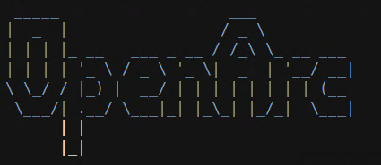
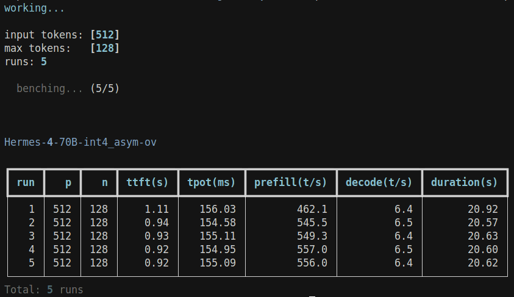
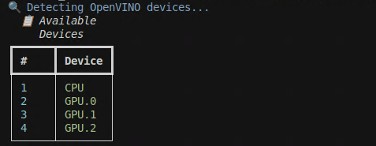

[](https://discord.gg/Bzz9hax9Jq)
[](https://huggingface.co/Echo9Zulu)
[](https://github.com/openvinotoolkit/openvino)
[](https://deepwiki.com/SearchSavior/OpenArc)

> [!NOTE]
> OpenArc is under active development.

**OpenArc** is an inference engine for Intel devices. Serve LLMs, VLMs, Whisper, Kokoro-TTS, Embedding and Reranker models over OpenAI compatible endpoints, powered by OpenVINO on your device. Local, private, open source AI.  

**OpenArc 2.0** arrives with more endpoints, better UX, pipeline paralell, NPU support and much more!

Drawing on ideas from `llama.cpp`, `vLLM`, `transformers`, `OpenVINO Model Server`, `Ray`, `Lemonade`, and other projects cited below, OpenArc has been a way for me to learn about inference engines by trying to build one myself.

Along the way a Discord community has formed around this project, which was unexpected! If you are interested in using Intel devices for AI and machine learning, feel free to stop by. 

Thanks to everyone on Discord for their continued support!

## Table of Contents

- [Features](#features)
- [Quickstart](#quickstart)
  - [Linux](#linux)
  - [Windows](#windows)
  - [Docker](#docker)
- [OpenArc CLI](#openarc-cli)
  - [openarc add](#openarc-add)
  - [openarc list](#openarc-list)
  - [openarc serve](#openarc-serve)
  - [openarc load](#openarc-load)
  - [openarc status](#openarc-status)
  - [openarc bench](#openarc-bench)
  - [openarc tool](#openarc-tool)
- [Model Sources](#model-sources)
  - [LLMs](#llms)
  - [VLMs](#vlms)
  - [Whisper](#whisper)
  - [Kokoro](#kokoro)
  - [Embedding](#embedding)
  - [Reranker](#reranker)
- [Converting Models to OpenVINO IR](#converting-models-to-openvino-ir)
- [Learning Resources](#learning-resources)
- [Acknowledgments](#acknowledgments)
- [Codebase Documentation](./docs/index.md)

## Features
  - NEW! Containerization with Docker #60 by @meatposes
  - NEW! Speculative decoding support for LLMs #57 by @meatposes
  - NEW! Streaming cancellation support for LLMs and VLMs
  - Multi GPU Pipeline Paralell
  - CPU offload/Hybrid device
  - NPU device support
  - OpenAI compatible endpoints
      - `/v1/models`
      - `/v1/completions`: `llm` only
      - `/v1/chat/completions`
      - `/v1/audio/transcriptions`: `whisper` only
      - `/v1/audio/speech`: `kokoro` only       
      - `/v1/embeddings`: `qwen3-embedding` #33 by @mwrothbe
      - `/v1/rerank`: `qwen3-reranker` #39 by @mwrothbe
  - `jinja` templating with `AutoTokenizers`
  - OpenAI Compatible tool calls with streaming and paralell 
    - tool call parser currently reads "name", "argument" 
  - Fully async multi engine, multi task architecture
  - Model concurrency: load and infer multiple models at once
  - Automatic unload on inference failure
  - `llama-bench` style benchmarking for `llm` w/automatic sqlite database
  - metrics on every request
    - ttft
    - prefill_throughput
    - decode_throughput
    - decode_duration
    - tpot
    - load time
    - stream mode
  - More OpenVINO [examples](examples/)
  - OpenVINO implementation of [hexgrad/Kokoro-82M](https://huggingface.co/hexgrad/Kokoro-82M)
  

> [!NOTE] 
> Interested in contributing? Please open an issue before submitting a PR!

<div align="right">

[↑ Top](#table-of-contents)

</div>

## Quickstart 

<details id="linux">
<summary><strong style="font-size: 1.2em;">Linux</strong></summary>

<br>

1. OpenVINO requires **device specifc drivers**.
 
- Visit [OpenVINO System Requirments](https://docs.openvino.ai/2025/about-openvino/release-notes-openvino/system-requirements.html#cpu) for the latest information on drivers.

2. Install uv from [astral](https://docs.astral.sh/uv/getting-started/installation/#standalone-installer)

3. After cloning use:

```
uv sync
```

4. Activate your environment with:

```
source .venv/bin/activate
```

Build latest optimum
```
uv pip install "optimum-intel[openvino] @ git+https://github.com/huggingface/optimum-intel"
```

Build latest OpenVINO and OpenVINO GenAI from nightly wheels
```
uv pip install --pre -U openvino-genai --extra-index-url https://storage.openvinotoolkit.org/simple/wheels/nightly
```

5. Set your API key as an environment variable:
```
	export OPENARC_API_KEY=<api-key>
```

6. To get started, run:

```
openarc --help
```

</details>

<details id="windows">
<summary><strong style="font-size: 1.2em;">Windows</strong></summary>

<br>

1. OpenVINO requires **device specifc drivers**.
 
- Visit [OpenVINO System Requirments](https://docs.openvino.ai/2025/about-openvino/release-notes-openvino/system-requirements.html#cpu) to get the latest information on drivers.

2. Install uv from [astral](https://docs.astral.sh/uv/getting-started/installation/#standalone-installer)

3. Clone OpenArc, enter the directory and run:
  ```
  uv sync
  ```

4. Activate your environment with:

```
.venv\Scripts\activate
```

Build latest optimum
```
uv pip install "optimum-intel[openvino] @ git+https://github.com/huggingface/optimum-intel"
```

Build latest OpenVINO and OpenVINO GenAI from nightly wheels
```
uv pip install --pre -U openvino-genai --extra-index-url https://storage.openvinotoolkit.org/simple/wheels/nightly
```

5. Set your API key as an environment variable:
```
setx OPENARC_API_KEY openarc-api-key
```

6. To get started, run:

```
openarc --help
```

</details>

<details id="docker">
<summary><strong style="font-size: 1.2em;">Docker</strong></summary>

<br>

Instead of fighting with Intel's own docker images, we built our own which is as close to boilerplate as possible. For a primer on docker [check out this video](https://www.youtube.com/watch?v=DQdB7wFEygo).


**Build and run the container:**
```bash
docker-compose up --build -d
```

**Run the container:**
```bash
docker run -d -p 8000:8000 openarc:latest
```
**Enter the container:**
```bash
docker exec -it openarc /bin/bash
```

## Environment Variables

```bash
export OPENARC_API_KEY="openarc-api-key" # default, set it to whatever you want
export OPENARC_AUTOLOAD_MODEL="model_name" # model_name to load on startup
export MODEL_PATH="/path/to/your/models" # mount your models to `/models` inside the container
docker-compose up --build -d
```


Take a look at the [Dockerfile](Dockerfile) and [docker-compose](docker-compose.yaml) for more details.

</details>

<br>

> [!NOTE]
> Need help installing drivers? [Join our Discord](https://discord.gg/Bzz9hax9Jq) or open an issue.

> [!NOTE] 
> uv has a [pip interface](https://docs.astral.sh/uv/pip/) which is a drop in replacement for pip, but faster. Pretty cool, and a good place to start learning uv.

## OpenArc CLI

This section documents the CLI commands available to you.

OpenArc command line tool helps you manage the server by packaging requests; every operation the command line does can be scripted programmatically, but using the command tool will help you get a feel for what the server does and how you can use it.  

## Getting Started

After choosing a model, use commands in this order:

- Add model configurations with `openarc add`, 

Here's an example for Gemma 3 VLM on GPU:

```
openarc add --model-name <model-name> --model-path <path/to/model> --engine ovgenai --model-type vlm --device GPU.0 --vlm-type gemma3
```

And all LLM on GPU:

```
openarc add --model-name <model-name> --model-path <path/to/model> --engine ovgenai --model-type llm --device GPU.0
```

Next up:

- Show added configurations with `openarc list`, 
- Launch the server with `openarc serve`, 
- Load models with `openarc load` 
- Check a model's status using `openarc status`. 
- Benchmark performance like llama-bench with `openarc-bench`
- Call utility scripts with `openarc tool`

Each command has groups of options which offer fine-grained control of both server behavior and performance optimizations, which are documented here with examples to get you started. Remember to use this as reference.

Use `openarc [OPTION] --help` to see available arguments at any time as you work through the reference. 


## Reference

<details id="openarc-add">
<summary><code>openarc add</code></summary>

<br>

Add a model to `openarc_config.json` for easy loading with `openarc load`. 


### Single device

```
openarc add --model-name <model-name> --model-path <path/to/model> --engine <engine> --model-type <model-type> --device <target-device>
```

To see what options you have for `--device`, use `openarc tool device-detect`.

### VLM

```
openarc add --model-name <model-name> --model-path <path/to/model> --engine <engine> --model-type <model-type> --device <target-device> --vlm-type <vlm-type>
```
Getting VLM to work the way I wanted required using VLMPipeline in ways that are not well documented. You can look at the [code](src/engine/ov_genai/vlm.py#L33) to see where the magic happens. 

`vlm-type` maps a vision token for a given architecture using strings like `qwen25vl`, `phi4mm` and more. Use `openarc add --help` to see the available options. The server will complain if you get anything wrong, so it should be easy to figure out.

### Whisper

```
openarc add --model-name <model-name> --model-path <path/to/whisper> --engine ovgenai --model-type whisper --device <target-device> 
```

### Kokoro (CPU only)

```
openarc add --model-name <model-name> --model-path <path/to/kokoro> --engine openvino --model-type kokoro --device CPU 
```

### Advanced Configuration Options

`runtime-config` accepts many options to modify `openvino` runtime behavior for different inference scenarios. OpenArc reports c++ errors to the server when these fail, making experimentation easy. 

See OpenVINO documentation on [Inference Optimization](https://docs.openvino.ai/2025/openvino-workflow/running-inference/optimize-inference.html) to learn more about what can be customized.

Most options get really deep into OpenVINO concepts that are way out of scope for the README; however `runtime-config` is the entrypoint for *all* of them. Broadly, what you set in `runtime-config` Unfortunately, not all options are designed for transformers, so `runtime-config` was implemented in a way where you immediately get feedback. Add a kwarg, load the model, get feedback from the server, run `openarc bench`. Overall, it's a clean way to handle the hardest part of OpenVINO documentation.

Review [pipeline-paralellism preview](https://docs.openvino.ai/2025/openvino-workflow/running-inference/inference-devices-and-modes/hetero-execution.html#pipeline-parallelism-preview) to learn how you can customize multi device inference using HETERO device plugin. Some example commands are provided for a few difference scenarios:

### Multi-GPU Pipeline Paralell

```
openarc add --model-name <model-name> --model-path <path/to/model> --engine ovgenai --model-type llm --device HETERO:GPU.0,GPU.1 --runtime-config "{"MODEL_DISTRIBUTION_POLICY": "PIPELINE_PARALLEL"}"
```

### Tensor Paralell (CPU only)

Requires more than one CPU socket in a single node.

```
openarc add --model-name <model-name> --model-path <path/to/model> --engine ovgenai --model-type llm --device CPU --runtime-config "{"MODEL_DISTRIBUTION_POLICY": "TENSOR_PARALLEL"}"
```
---

### Hybrid Mode/CPU Offload

```
openarc add --model-name <model-name> -model-path <path/to/model> --engine ovgenai --model-type llm --device HETERO:GPU.0,CPU --runtime-config "{"MODEL_DISTRIBUTION_POLICY": "PIPELINE_PARALLEL"}"
```

### Speculative Decoding

```
openarc add --model-name <model-name> --model-path <path/to/model> --engine ovgenai --model-type llm --device GPU.0 --draft-model-path <path/to/draftmodel> --draft-device CPU --num-assistant-tokens 5 --assistant-confidence-threshold 0.5
```


</details>


<details id="openarc-list">
<summary><code>openarc list</code></summary>

<br>

Reads added configurations from `openarc_config.json`.

Display all saved configurations:
```
openarc list
```

Remove a configuration:
```
openarc list --remove --model-name <model-name>
```

</details>


<details id="openarc-serve">
<summary><code>openarc serve</code></summary>

<br>

Starts the server.

```
openarc serve start # defauls to 0.0.0.0:8000
```

Configure host and port

```
openarc serve start --host --openarc-port
```

To load models on startup:

```
openarc serve start --load-models model1 model2
```

</details>


<details id="openarc-load">
<summary><code>openarc load</code></summary>

<br>

After using ```openarc add``` you can use ```openarc load``` to read the added configuration and load models onto the OpenArc server. 

OpenArc uses arguments from ```openarc add``` as metadata to make routing decisions internally; you are querying for correct inference code.

```
openarc load <model-name>
```

To load multiple models at once, use:

```
openarc load <model-name1> <model-name2> <model-name3>
```

Be mindful of your resources; loading models can be resource intensive! On the first load, OpenVINO performs model compilation for the target `--device`.

When `openarc load` fails, the CLI tool displays a full stack trace to help you figure out why.


</details>


<details id="openarc-status">
<summary><code>openarc status</code></summary>

<br>

Calls /openarc/status endpoint and returns a report. Shows loaded models.

```
openarc status
```

</details>


<details id="openarc-bench">
<summary><code>openarc bench</code></summary>

<br>

Benchmark `llm` performance with pseudo-random input tokens.

This approach follows [llama-bench](https://github.com/ggml-org/llama.cpp/blob/683fa6ba/tools/llama-bench/llama-bench.cpp#L1922), providing a baseline for the community to assess inference performance between `llama.cpp` backends and `openvino`.

To support different `llm` tokenizers, we need to standardize how tokens are chosen for benchmark inference. When you set `--p` we select `512` pseudo-random tokens as input_ids from the set of all tokens in the vocabulary. 

`--n` controls the maximum amount of tokens we allow the model to generate; this bypasses `eos` and sets a hard upper limit.

Default values are:
```
openarc bench <model-name> --p <512> --n <128> --r <5>
```
Which gives:




`openarc bench` also records metrics in a sqlite database `openarc_bench.db` for easy analysis.

</details>


<details id="openarc-tool">
<summary><code>openarc tool</code></summary>

<br>

Utility scripts.

To see `openvino` properties your device supports use:

```
openarc tool device-props
```

To see available devices use:

```
openarc tool device-detect
```



</details>

---

<br>

<div align="right">

[↑ Top](#table-of-contents)

</div>

## Model Sources

There are a few sources of preconverted models which can be used with OpenArc;

[OpenVINO on HuggingFace](https://huggingface.co/collections/OpenVINO/llm-6687aaa2abca3bbcec71a9bd)

[My HuggingFace repo](https://huggingface.co/Echo9Zulu)

[LLMs optimized for NPU](https://huggingface.co/collections/OpenVINO/llms-optimized-for-npu-686e7f0bf7bc184bd71f8ba0)


### More models to get you started!

<details id="llms">
<summary>LLMs</summary>

<br>

| **Models** |
| --- |
| [Echo9Zulu/Qwen3-1.7B-int8_asym-ov](https://huggingface.co/Echo9Zulu/Qwen3-1.7B-int8_asym-ov/tree/main) |
| [Echo9Zulu/Qwen3-4B-Instruct-2507-int4_asym-awq-ov](https://huggingface.co/Echo9Zulu/Qwen3-4B-Instruct-2507-int4_asym-awq-ov) |
| [Gapeleon/Satyr-V0.1-4B-HF-int4_awq-ov](https://huggingface.co/Gapeleon/Satyr-V0.1-4B-HF-int4_awq-ov?not-for-all-audiences=true) |
| [Echo9Zulu/Dolphin-X1-8B-int4_asym-awq-ov](https://huggingface.co/Echo9Zulu/Dolphin-X1-8B-int4_asym-awq-ov) |
| [Echo9Zulu/Qwen3-8B-ShiningValiant3-int4-asym-ov](https://huggingface.co/Echo9Zulu/Qwen3-8B-ShiningValiant3-int4-asym-ov) |
| [Echo9Zulu/Qwen3-14B-int4_sym-ov](https://huggingface.co/Echo9Zulu/Qwen3-14B-int4_sym-ov/tree/main) |
| [Echo9Zulu/Cydonia-24B-v4.2.0-int4_asym-awq-ov](https://huggingface.co/Echo9Zulu/Cydonia-24B-v4.2.0-int4_asym-awq-ov) |
| [Echo9Zulu/Qwen2.5-Microsoft-NextCoder-Soar-Instruct-FUSED-CODER-Fast-11B-int4_asym-awq-ov](https://huggingface.co/Echo9Zulu/Qwen2.5-Microsoft-NextCoder-Soar-Instruct-FUSED-CODER-Fast-11B-int4_asym-awq-ov) |
| [Echo9Zulu/Magistral-Small-2509-Text-Only-int4_asym-awq-ov](https://huggingface.co/Echo9Zulu/Magistral-Small-2509-Text-Only-int4_asym-awq-ov) |
| [Echo9Zulu/Hermes-4-70B-int4_asym-awq-ov](https://huggingface.co/Echo9Zulu/Hermes-4-70B-int4_asym-awq-ov) |
| [Echo9Zulu/Qwen2.5-Coder-32B-Instruct-int4_sym-awq-ov](https://huggingface.co/Echo9Zulu/Qwen2.5-Coder-32B-Instruct-int4_sym-awq-ov) |
| [Echo9Zulu/Qwen3-32B-Instruct-int4_sym-awq-ov](https://huggingface.co/Echo9Zulu/Qwen3-32B-Instruct-int4_sym-awq-ov) |

</details>

<details id="vlms">
<summary>VLMs</summary>

<br>

| **Models** |
| --- |
| [Echo9Zulu/gemma-3-4b-it-int8_asym-ov](https://huggingface.co/Echo9Zulu/gemma-3-4b-it-int8_asym-ov) |
| [Echo9Zulu/Gemma-3-12b-it-qat-int4_asym-ov](https://huggingface.co/Echo9Zulu/Gemma-3-12b-it-qat-int4_asym-ov) |
| [Echo9Zulu/Qwen2.5-VL-7B-Instruct-int4_sym-ov](https://huggingface.co/Echo9Zulu/Qwen2.5-VL-7B-Instruct-int4_sym-ov/tree/main) |
| [Echo9Zulu/Nanonets-OCR2-3B-LM-INT4_ASYM-VE-FP16-ov](https://huggingface.co/Echo9Zulu/Nanonets-OCR2-3B-LM-INT4_ASYM-VE-FP16-ov) |

</details>

<details id="whisper">
<summary>Whisper</summary>

<br>

| **Models** |
| --- |
| [OpenVINO/distil-whisper-large-v3-int8-ov](https://huggingface.co/OpenVINO/distil-whisper-large-v3-int8-ov) |
| [OpenVINO/distil-whisper-large-v3-fp16-ov](https://huggingface.co/OpenVINO/distil-whisper-large-v3-fp16-ov) |
| [OpenVINO/whisper-large-v3-int8-ov](https://huggingface.co/OpenVINO/whisper-large-v3-int8-ov/tree/main) |
| [OpenVINO/openai-whisper-large-v3-fp16-ov](https://huggingface.co/OpenVINO/openai-whisper-large-v3-fp16-ov/tree/main) |

</details>

<details id="kokoro">
<summary>Kokoro</summary>

<br>

| **Models** |
| --- |
| [Echo9Zulu/Kokoro-82M-FP16-OpenVINO](https://huggingface.co/Echo9Zulu/Kokoro-82M-FP16-OpenVINO) |

</details>

<details id="embedding">
<summary>Embedding</summary>

<br>

| **Models** |
| --- |
| [Echo9Zulu/Qwen3-Embedding-0.6B-int8_asym-ov](https://huggingface.co/Echo9Zulu/Qwen3-Embedding-0.6B-int8_asym-ov) |

</details>

<details id="reranker">
<summary>Reranker</summary>

<br>

| **Models** |
| --- |
| [OpenVINO/Qwen3-Reranker-0.6B-fp16-ov](https://huggingface.co/OpenVINO/Qwen3-Reranker-0.6B-fp16-ov) |

</details>

<div align="right">

[↑ Top](#table-of-contents)

</div>

### Converting Models to OpenVINO IR

Optimum-Intel provides [a hands on primer](https://huggingface.co/docs/optimum/main/en/intel/openvino/optimization) you can use to build some intuition about quantization and post training optimization using OpenVINO. 

Intel provides a suite of tools you can use to apply different post training optimization techniques developed over at [Neural Network Compression Framwork](https://github.com/openvinotoolkit/nncf). 

- Use the [Optimum-CLI conversion tool](https://huggingface.co/docs/optimum/main/en/intel/openvino/export) to learn how you can convert models to OpenVINO IR from other formats.

- Visit [Supported Architectures](https://huggingface.co/docs/optimum/main/en/intel/openvino/models) to see what models can be converted to OpenVINO using the tools described in this section.

- If you use the CLI tool and get an error about an unsupported architecture or "missing export config" follow the link, [open an issue](https://github.com/huggingface/optimum-intel/issues) reference the model card and the maintainers will get back to you.  

<div align="right">

[↑ Top](#table-of-contents)

</div>

### Demos

Demos help illustrate what you can do with OpenArc and are meant to be extended. I will continue adding to these, but for now they are a good start.

[talk_to_llm.py](hackables/talk_to_llm.py) sets up a "chain" between whisper, an LLM, and kokoro. Talk with any LLM you can run on your PC from the command line. Accumulates context and does not filter reasoning (very interesting). 

[whisper_button.py](hackables/whisper_button.py) use spacebar to record audio with whisper and see the transcription right in the terminal. NPU users should probably start here. 


### Resources

Learn more about how to leverage your Intel devices for Machine Learning:

[Install OpenVINO](https://docs.openvino.ai/2025/get-started/install-openvino.html?PACKAGE=OPENVINO_GENAI&VERSION=NIGHTLY&OP_SYSTEM=LINUX&DISTRIBUTION=PIP)

[openvino_notebooks](https://github.com/openvinotoolkit/openvino_notebooks)

[OpenVINO Python API](https://docs.openvino.ai/2025/api/ie_python_api/api.html)

[OpenVINO GenAI Python API](https://docs.openvino.ai/2025/api/genai_api/_autosummary/openvino_genai.html)

[Inference with Optimum-Intel](https://github.com/huggingface/optimum-intel/blob/main/notebooks/openvino/optimum_openvino_inference.ipynb)

[Optimum-Intel](https://huggingface.co/docs/optimum/main/en/intel/index)

[NPU Devices](https://docs.openvino.ai/2025/openvino-workflow/running-inference/inference-devices-and-modes/npu-device.html)

[vllm with IPEX](https://docs.vllm.ai/en/v0.5.1/getting_started/xpu-installation.html)

[Mutli GPU Pipeline Paralell with OpenVINO Model Server](https://docs.openvino.ai/2025/model-server/ovms_demos_continuous_batching_scaling.html#multi-gpu-configuration-loading-models-exceeding-a-single-card-vram)

[Transformers Auto Classes](https://huggingface.co/docs/transformers/en/model_doc/auto#auto-classes)

<div align="right">

[↑ Top](#table-of-contents)

</div>

## Acknowledgments

OpenArc stands on the shoulders of many other projects:

[Optimum-Intel](https://github.com/huggingface/optimum-intel)

[OpenVINO](https://github.com/openvinotoolkit/openvino)

[OpenVINO GenAI](https://github.com/openvinotoolkit/openvino.genai)

[llama.cpp](https://github.com/ggml-org/llama.cpp)

[vLLM](https://github.com/vllm-project/vllm)

[Transformers](https://github.com/huggingface/transformers)

[FastAPI](https://github.com/fastapi/fastapi)

[click](https://github.com/pallets/click)

[rich-click](https://github.com/ewels/rich-click)

```
@article{zhou2024survey,
  title={A Survey on Efficient Inference for Large Language Models},
  author={Zhou, Zixuan and Ning, Xuefei and Hong, Ke and Fu, Tianyu and Xu, Jiaming and Li, Shiyao and Lou, Yuming and Wang, Luning and Yuan, Zhihang and Li, Xiuhong and Yan, Shengen and Dai, Guohao and Zhang, Xiao-Ping and Dong, Yuhan and Wang, Yu},
  journal={arXiv preprint arXiv:2404.14294},
  year={2024}
}
```
Thanks for your work!!


