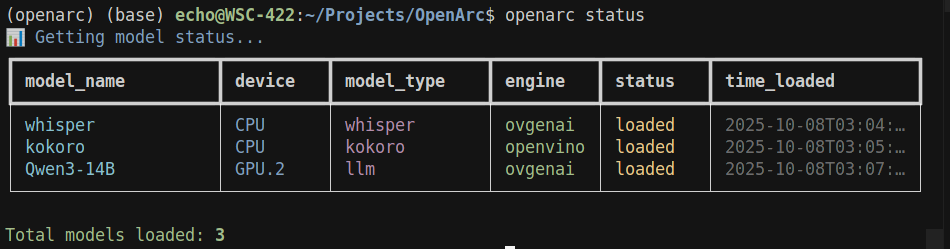

[](https://discord.gg/Bzz9hax9Jq)
[](https://huggingface.co/Echo9Zulu)


> [!NOTE]
> OpenArc is under active development.

**OpenArc** is an inference engine for Intel devices. Serve LLMs, VLMs, Whisper, Kokoro-TTS and Embedding models over OpenAI compatible endpoints, powered by OpenVINO.

**OpenArc 2.0** arrives with more endpoints, better UX, pipeline paralell, NPU support and much more!

## What's new?

Drawing on ideas from `llama.cpp`, `vLLM`, `transformers`, `OpenVINO Model Server`, `Ray`, `Lemonade`, and other projects, OpenArc has evolved into a capable serving engine for AI workloads on Intel devices.

New Features:
  - Multi GPU Pipeline Paralell
  - CPU offload/Hybrid device
  - NPU device support
  - OpenAI compatible endpoints
      - `/v1/models`
      - `/v1/completions`: `llm` only
      - `/v1/chat/completions`
      - `/v1/embeddings`: 
      - `/v1/audio/transcriptions`: `whisper` only
      - `/v1/audio/speech`: `kokoro` only       
  - `jinja` templating with `AutoTokenizers`
  - OpenAI compatible tool use with streaming
  - Fully async multi engine, multi task architecture
  - Model concurrency: load and infer multiple models at once
  - Performance metrics on every request
    - prefill_throughput
    - ttft
    - decode_throughput
    - decode_duration
    - tpot
    - load time
    - stream mode


> [!NOTE] 
> Interested in contributing? Please open an issue before submitting a PR!

## Quickstart 

<details>
  <summary>Linux</summary>
<br>

1. OpenVINO requires **device specifc drivers**.
 
- Visit [OpenVINO System Requirments](https://docs.openvino.ai/2025/about-openvino/release-notes-openvino/system-requirements.html#cpu) for the latest information on drivers.

> [!NOTE] 
> Need help installing drivers? [Join our Discord](https://discord.gg/Bzz9hax9Jq) or open an issue.

2. Install uv from [astral](https://docs.astral.sh/uv/getting-started/installation/#standalone-installer)

3. After cloning use:

```
uv sync
```

4. Activate your environment with:

```
source .venv/bin/activate
```

Build latest optimum
```
uv pip install "optimum-intel[openvino] @ git+https://github.com/huggingface/optimum-intel"
```

Build latest OpenVINO and OpenVINO GenAI from nightly wheels
```
uv pip install --pre -U openvino-genai --extra-index-url https://storage.openvinotoolkit.org/simple/wheels/nightly
```


5. Set your API key as an environment variable:

	export OPENARC_API_KEY=<api-key>

> [!NOTE] 
> uv has a [pip interface](https://docs.astral.sh/uv/pip/) which is a drop in replacement for pip, but faster. Pretty cool, and a good place to start.


6. To get started, run:

```
openarc --help
```

</details>

<details>
  <summary>Windows</summary>

1. OpenVINO requires **device specifc drivers**.
 
- Visit [OpenVINO System Requirments](https://docs.openvino.ai/2025/about-openvino/release-notes-openvino/system-requirements.html#cpu) to get the latest information on drivers.

> [!NOTE]
> Need help installing drivers? [Join our Discord](https://discord.gg/Bzz9hax9Jq) or open an issue.


2. Install uv from [astral](https://docs.astral.sh/uv/getting-started/installation/#standalone-installer)

3. Clone OpenArc, enter the directory and run:
  ```
  uv sync
  ```

Build latest optimum
```
uv pip install "optimum-intel[openvino] @ git+https://github.com/huggingface/optimum-intel"
```

Build latest OpenVINO and OpenVINO GenAI from nightly wheels
```
uv pip install --pre -U openvino-genai --extra-index-url https://storage.openvinotoolkit.org/simple/wheels/nightly
```

4. Set your API key as an environment variable:
```
setx OPENARC_API_KEY openarc-api-key
```

5. To get started, run:

```
openarc --help
```

> [!NOTE] 
> uv has a [pip interface](https://docs.astral.sh/uv/pip/) which is a drop in replacement for pip, but faster. Pretty cool, and a good place to start.

</details>

## OpenArc CLI

<details>
  <summary><code>openarc add</code></summary>
<br>

Add a model to openarc-config.json for easy loading with ```openarc load```.
> [!] For vision language models, use `vlm` instead of `llm` for `--model-type`.

#### Single device

```
openarc add --model-name <model-name> --model-path <path/to/model> --engine <engine> --model-type <model-type> --device <target-device>
```

#### VLM

```
openarc add --model-name <model-name> --model-path <path/to/model> --engine <engine> --model-type <model-type> --device <target-device> --vlm-type <vlm-type>
```
Getting VLM to work the way I wanted required using VLMPipeline in ways that are not well documented. You can look at the [code](src/engine/ov_genai/vlm.py#L33) to see where the magic happens. 

`vlm-type` maps a vision token for a given architecture using strings like `qwen25vl`, `phi4mm`. Use `openarc add --help` to see the available options. The server will complain if you get anything wrong, so it should be easy to figure out.

#### Whisper

```
openarc add --model-name <model-name> --model-path <path/to/whisper> --engine ovgenai --model-type whisper --device <target-device> 
```

#### Kokoro (CPU only)

```
openarc add --model-name <model-name> --model-path <path/to/kokoro> --engine openvino --model-type kokoro --device CPU 
```


#### ```runtime-config```

Accepts many options to modify ```openvino``` runtime behavior for different inference scenarios. OpenArc will report errors to the server when the fail, making experimentation easy.

See OpenVINO documentation on [Inference Optimization](https://docs.openvino.ai/2025/openvino-workflow/running-inference/optimize-inference.html) to learn more about what can be customized. 

Review [pipeline-paralellism preview](https://docs.openvino.ai/2025/openvino-workflow/running-inference/inference-devices-and-modes/hetero-execution.html#pipeline-parallelism-preview) to learn how you can customize multi device inference using HETERO device plugin. Some example commands are provided for a few difference scenarios:

#### Hybrid Mode/CPU Offload

```
openarc add --model-name <model-name> -model-path <path/to/model> --engine ovgenai --model-type llm --device <HETERO:GPU.0,CPU> --runtime-config {"MODEL_DISTRIBUTION_POLICY": "PIPELINE_PARALLEL"}
```

#### Multi-GPU Pipeline Paralell

```
openarc add --model-name <model-name> --model-path <path/to/model> --engine ovgenai --model-type llm --device <HETERO:GPU.0,GPU.1> --runtime-config {"MODEL_DISTRIBUTION_POLICY": "PIPELINE_PARALLEL"}
```

#### Tensor Paralell (CPU only)

Requires more than one CPU socket in a single node.

```
openarc add --model-name <model-name> --model-path <path/to/model> --engine ovgenai --model-type llm --device CPU --runtime-config {"MODEL_DISTRIBUTION_POLICY": "TENSOR_PARALLEL"}
```
---

</details>

<details>
  <summary><code>openarc list</code></summary>
<br>

Reads added configurations from ```openarc-config.json```.

Display all saved configurations:
```
openarc list
```

Remove a configuration:
```
openarc list --rm --model-name <model-name>
```

</details>

<details>
  <summary><code>openarc serve</code></summary>
<br>


Starts the server.

```
openarc serve start # defauls to 0.0.0.0:8000
```

Configure host and port

```
openarc serve start --host --openarc-port
```

Load models on startup

```
openarc serve start --load-models model1 model2
```


</details>

<details>
  <summary><code>openarc load</code></summary>
<br>


After using ```openarc add``` you can use ```openarc load``` to read the added configuration and load models onto the OpenArc server. 

OpenArc uses arguments from ```openarc add``` as metadata to make routing decisions internally; you are querying for correct inference code.

```
openarc load <model-name>
```

To load multiple models at once, use:

```
openarc load <model-name1> <model-name2> <model-name3>
```

Be mindful of your resources; loading models can be resource intensive! On the first load, OpenVINO performs model compilation for the target `--device`.

When an ```openarc load``` command fails, the CLI tool displays the full stack trace to help you figure out why.

</details>

<details>
  <summary><code>openarc status</code></summary>
<br>


Calls /openarc/status endpoint and returns a report. Shows loaded models.

```
openarc status
```



</details>

<details>
  <summary><code>openarc tool</code></summary>
<br>


Utility scripts.

To see OpenVINO properties your device supports use:

```
openarc tool device-props
```

To see available devices use:

```
openarc tool device-detect
```


---

</details>

<br>

### Model Sources

There are a few sources of preconverted models which can be used with OpenArc;

[OpenVINO on HuggingFace](https://huggingface.co/collections/OpenVINO/llm-6687aaa2abca3bbcec71a9bd)

[My HuggingFace repo](https://huggingface.co/Echo9Zulu)

[LLMs optimized for NPU](https://huggingface.co/collections/OpenVINO/llms-optimized-for-npu-686e7f0bf7bc184bd71f8ba0)


#### More models to get you started!

<details>
  <summary><strong>LLMs</strong></summary>
<br>

| **Models** |
| --- |
| [Echo9Zulu/Qwen3-1.7B-int8_asym-ov](https://huggingface.co/Echo9Zulu/Qwen3-1.7B-int8_asym-ov/tree/main) |
| [Echo9Zulu/Qwen3-4B-Instruct-2507-int4_asym-awq-ov](https://huggingface.co/Echo9Zulu/Qwen3-4B-Instruct-2507-int4_asym-awq-ov) |
| [Gapeleon/Satyr-V0.1-4B-HF-int4_awq-ov](https://huggingface.co/Gapeleon/Satyr-V0.1-4B-HF-int4_awq-ov?not-for-all-audiences=true) |
[Echo9Zulu/Dolphin-X1-8B-int4_asym-awq-ov](https://huggingface.co/Echo9Zulu/Dolphin-X1-8B-int4_asym-awq-ov) |
[Echo9Zulu/Qwen3-14B-int4_sym-ov](https://huggingface.co/Echo9Zulu/Qwen3-14B-int4_sym-ov/tree/main) | 
[Echo9Zulu/Magistral-Small-2509-Text-Only-int4_asym-awq-ov](https://huggingface.co/Echo9Zulu/Magistral-Small-2509-Text-Only-int4_asym-awq-ov) |
| [Echo9Zulu/Hermes-4-70B-int4_asym-awq-ov](https://huggingface.co/Echo9Zulu/Hermes-4-70B-int4_asym-awq-ov) |
| [Echo9Zulu/Qwen2.5-Coder-32B-Instruct-int4_sym-awq-ov](https://huggingface.co/Echo9Zulu/Qwen2.5-Coder-32B-Instruct-int4_sym-awq-ov) |

</details>

<details>
  <summary><strong>VLMs</strong></summary>
<br>

| **Models** |
| --- |
| [Echo9Zulu/gemma-3-4b-it-int8_asym-ov](https://huggingface.co/Echo9Zulu/gemma-3-4b-it-int8_asym-ov) |
| [Echo9Zulu/Gemma-3-12b-it-qat-int4_asym-ov](https://huggingface.co/Echo9Zulu/Gemma-3-12b-it-qat-int4_asym-ov) |
| [Echo9Zulu/Qwen2.5-VL-7B-Instruct-int4_sym-ov](https://huggingface.co/Echo9Zulu/Qwen2.5-VL-7B-Instruct-int4_sym-ov/tree/main) |
| [Echo9Zulu/Nanonets-OCR2-3B-LM-INT4_ASYM-VE-FP16-ov](https://huggingface.co/Echo9Zulu/Nanonets-OCR2-3B-LM-INT4_ASYM-VE-FP16-ov) |

</details>


<details>
  <summary><strong>Whisper</strong></summary>
<br>

| **Models** |
| --- |
| [OpenVINO/distil-whisper-large-v3-int8-ov](https://huggingface.co/OpenVINO/distil-whisper-large-v3-int8-ov) |
| [OpenVINO/distil-whisper-large-v3-fp16-ov](https://huggingface.co/OpenVINO/distil-whisper-large-v3-fp16-ov) |
| [OpenVINO/whisper-large-v3-int8-ov](https://huggingface.co/OpenVINO/whisper-large-v3-int8-ov/tree/main) |
| [OpenVINO/openai-whisper-large-v3-fp16-ov](https://huggingface.co/OpenVINO/openai-whisper-large-v3-fp16-ov/tree/main) |

</details>

<details>
  <summary><strong>Kokoro</strong></summary>
<br>

| **Models** |
| --- |
| [Echo9Zulu/Kokoro-82M-FP16-OpenVINO](https://huggingface.co/Echo9Zulu/Kokoro-82M-FP16-OpenVINO) |

</details>

<details>
  <summary><strong>Embedding</strong></summary>
<br>

| **Models** |
| --- |
| [Echo9Zulu/Qwen3-Embedding-0.6B-int8_asym-ov](https://huggingface.co/Echo9Zulu/Qwen3-Embedding-0.6B-int8_asym-ov) |

</details>

<details>
  <summary><strong>Reranker</strong></summary>
<br>

| **Models** |
| --- |
| [OpenVINO/Qwen3-Reranker-0.6B-fp16-ov](https://huggingface.co/OpenVINO/Qwen3-Reranker-0.6B-fp16-ov) |

</details>


### Converting Models to OpenVINO IR

Optimum-Intel provides [a hands on primer](https://huggingface.co/docs/optimum/main/en/intel/openvino/optimization) you can use to build some intuition about quantization and post training optimization using OpenVINO. 

Intel provides a suite of tools you can use to apply different post training optimization techniques developed over at [Neural Network Compression Framwork](https://github.com/openvinotoolkit/nncf). 

- Use the [Optimum-CLI conversion tool](https://huggingface.co/docs/optimum/main/en/intel/openvino/export) to learn how you can convert models to OpenVINO IR from other formats.

- Visit [Supported Architectures](https://huggingface.co/docs/optimum/main/en/intel/openvino/models) to see what models can be converted to OpenVINO using the tools described in this section.

- If you use the CLI tool and get an error about an unsupported architecture or "missing export config" follow the link, [open an issue](https://github.com/huggingface/optimum-intel/issues) reference the model card and the maintainers will get back to you.  

### Learning Resources

Learn more about how to leverage your Intel devices for Machine Learning:

[openvino_notebooks](https://github.com/openvinotoolkit/openvino_notebooks)

[Inference with Optimum-Intel](https://github.com/huggingface/optimum-intel/blob/main/notebooks/openvino/optimum_openvino_inference.ipynb)

[Optimum-Intel Transformers](https://huggingface.co/docs/optimum/main/en/intel/index)

[NPU Devices](https://docs.openvino.ai/2025/openvino-workflow/running-inference/inference-devices-and-modes/npu-device.html)

[vllm with IPEX](https://docs.vllm.ai/en/v0.5.1/getting_started/xpu-installation.html)

[Mutli GPU Pipeline Paralell with OpenVINO Model Server](https://docs.openvino.ai/2025/model-server/ovms_demos_continuous_batching_scaling.html#multi-gpu-configuration-loading-models-exceeding-a-single-card-vram)


## Acknowledgments

OpenArc stands on the shoulders of many other projects:

[Optimum-Intel](https://github.com/huggingface/optimum-intel)

[OpenVINO](https://github.com/openvinotoolkit/openvino)

[OpenVINO GenAI](https://github.com/openvinotoolkit/openvino.genai)

[llama.cpp](https://github.com/ggml-org/llama.cpp)

[vLLM](https://github.com/vllm-project/vllm)

[Transformers](https://github.com/huggingface/transformers)

[FastAPI](https://github.com/fastapi/fastapi)

[click](https://github.com/pallets/click)

[rich-click](https://github.com/ewels/rich-click)

Thanks for your work!!


