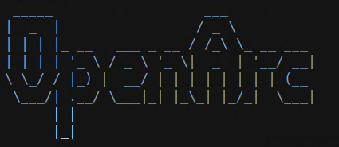

[](https://discord.gg/Bzz9hax9Jq)
[](https://huggingface.co/Echo9Zulu)
[](https://github.com/openvinotoolkit/openvino)
[](https://deepwiki.com/SearchSavior/OpenArc)
[](https://searchsavior.github.io/OpenArc/)

> [!NOTE]
> OpenArc is under active development.

**OpenArc** is an inference engine for Intel devices. 

Serve LLMs, VLMs, Whisper, Kokoro-TTS, Qwen-TTS, Qwen-ASR, Embedding and Reranker models over OpenAI compatible endpoints, powered by OpenVINO on your device. Local, private, open source AI.  

OpenArc is a community-driven effort to make acceleration from OpenVINO easier to access, deploy and benefit from. 

If you are interested in using Intel devices for AI and machine learning, feel free to stop by our Discord, where we are tracking almost the whole stack, including development of llama.cpp SYCL backend. 

Thanks to everyone on Discord for their continued support!

> [!NOTE]
> Documentation lives [here](https://searchsavior.github.io/OpenArc/)


## Quickstart

- [Linux](https://searchsavior.github.io/OpenArc/install/#linux)
- [Windows](https://searchsavior.github.io/OpenArc/install/#windows)
- [Docker](https://searchsavior.github.io/OpenArc/install/#docker)

## Features

  - NEW! Containerization with Docker #60 by @meatposes
  - NEW! Speculative decoding support for LLMs #57 by @meatposes
  - NEW! Streaming cancellation support for LLMs and VLMs
  - Multi GPU Pipeline Paralell
  - CPU offload/Hybrid device
  - NPU device support
  - OpenAI compatible endpoints
      - `/v1/models`
      - `/v1/completions`: `llm` only
      - `/v1/chat/completions`
      - `/v1/audio/transcriptions`: `whisper`, `qwen3_asr`
      - `/v1/audio/speech`: `kokoro` only       
      - `/v1/embeddings`: `qwen3-embedding` #33 by @mwrothbe
      - `/v1/rerank`: `qwen3-reranker` #39 by @mwrothbe
  - `jinja` templating with `AutoTokenizers`
  - OpenAI Compatible tool calls with streaming and paralell 
    - tool call parser currently reads "name", "argument" 
  - Fully async multi engine, multi task architecture
  - Model concurrency: load and infer multiple models at once
  - Automatic unload on inference failure
  - `llama-bench` style benchmarking for `llm` w/automatic sqlite database
  - metrics on every request
    - ttft
    - prefill_throughput
    - decode_throughput
    - decode_duration
    - tpot
    - load time
    - stream mode
  - More OpenVINO [examples](examples/)
  - OpenVINO implementation of [hexgrad/Kokoro-82M](https://huggingface.co/hexgrad/Kokoro-82M)
  - OpenVINO implementation of Qwen3-TTS and Qwen3-ASR
  

> [!NOTE] 
> Interested in contributing? Please open an issue before submitting a PR!


## Acknowledgments

OpenArc stands on the shoulders of many other projects:

[Optimum-Intel](https://github.com/huggingface/optimum-intel)

[OpenVINO](https://github.com/openvinotoolkit/openvino)

[OpenVINO GenAI](https://github.com/openvinotoolkit/openvino.genai)

[llama.cpp](https://github.com/ggml-org/llama.cpp)

[vLLM](https://github.com/vllm-project/vllm)

[Transformers](https://github.com/huggingface/transformers)

[FastAPI](https://github.com/fastapi/fastapi)

[click](https://github.com/pallets/click)

[rich-click](https://github.com/ewels/rich-click)

```
@article{zhou2024survey,
  title={A Survey on Efficient Inference for Large Language Models},
  author={Zhou, Zixuan and Ning, Xuefei and Hong, Ke and Fu, Tianyu and Xu, Jiaming and Li, Shiyao and Lou, Yuming and Wang, Luning and Yuan, Zhihang and Li, Xiuhong and Yan, Shengen and Dai, Guohao and Zhang, Xiao-Ping and Dong, Yuhan and Wang, Yu},
  journal={arXiv preprint arXiv:2404.14294},
  year={2024}
}
```
Thanks for your work!!


