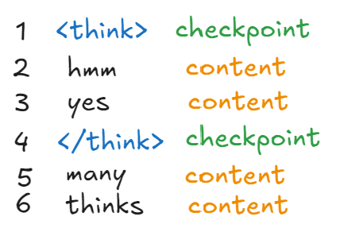
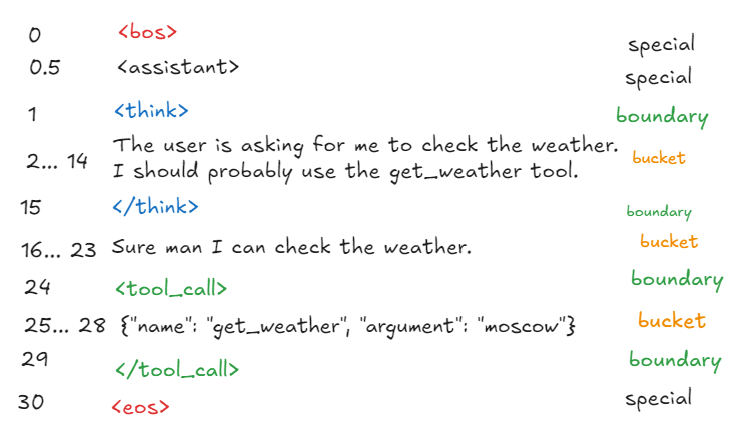

## Tool and Reasoning Parsing

OpenArc now supports "proper" tool and reasoning parsing for several architectures. Our approach ensures correct openai compatible parsing using openvino genai by leveraging some useful facts about tokens and will be the strategy going forward so I figured it would be a good idea to write down how it works. 

These changes took a few months (of inconsistent work :D) to get right due to difficulties in the deepest undocumented parts of openvino and openvino genai. Plus, I just wasn't happy where every attempted implementation ended up. 

To motivate our approach lets talk about tokens to capture some intuition. 

### Tokens as a straight line

Since Autoregressive language models emit tokens in a continuous stream one by one, it is safe to visualize them as a straight line. 

Taking some liberties for readability we can visualize tokens as single words in a sequence starting at 1:

In most tokenizers `<think>` is exactly one token, a fact we can use to check where the boundaries are in the raw token ids, before any algorithm touches them. A key thing is that the `<` can make it impossible to tokenize `<think>` into exactly one id- and because tokens always occur in a sequence determined by probabilities, we cannot easily check where these critical tokens are along our straight line. So, if a model emits a think tag in its reasoning and our code checks text for think tags we are screwed, and need a better way to make sure programs who use the output of ai systems get content in a consumable format. 

If we know that the important tokens who always have a stable id can be used as boundaries to check raw token ids, we can imagine `<think>` tags like a checkpoints along our sequence:

Now that we can be sure where the checkpoints we can write code that slices each section into its content, and safely tokenize each portion directly into buckets which are routed where they need to go.

So, for all models where this approach can be applied we will use it! The code lives under [src/engine/ov_genai/tool_parse](https://github.com/SearchSavior/OpenArc/tree/main/src/engine/ov_genai/tool_parse). Formally it follows a state machine pattern.

Further reading: 

[How does tokenization work, and why do LLMs usually rely on subword tokenizers such as BPE?](https://sebastianraschka.com/faq/docs/tokenization-bpe.html) - great overview

